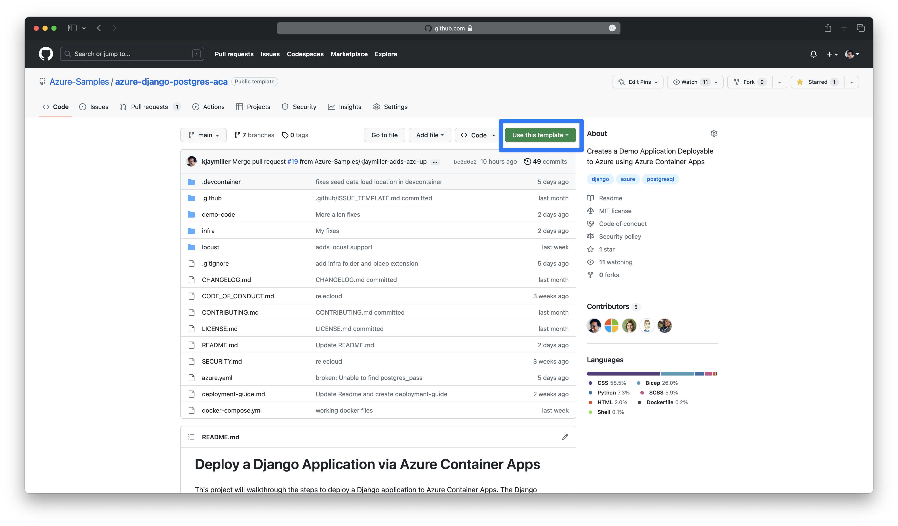

**01 Getting Started** | [02 Examining the Project](./02-examining-project.md) | [03 Testing](./03-testing.md) | [04 Deploying Locally](./04-deploying-locally.md) | [05 Deploying to Azure](./05-deploying-to-azure.md) | [06 Teardown](./06-teardown.md)

# 🚀 Get Ready for Takeoff

In this lab, you will deploy a Space Tourism site powered by Django and PostgreSQL using Azure Container Apps.

The steps below will get you up and running to deploy the Relecloud Django application to Azure Container Apps.

> **:car:💨 Fast Track**
> 
> If you are an experienced Django developer interested in learning how to deploy the application to Azure, check out our [Fast Track](./fasttrack.md). This walks you through the steps to deploy the application to Azure Container Apps, skipping the breakdown and testing stages. [Take the Fast Track](./fasttrack.md)

## Get Started
### Create your own repo from this template

Open the [Azure-Samples/azure-django-postgres-aca](https://github.com/Azure-Samples/azure-django-postgres-aca) repository, click the **Use this Template** button at the top right hand corner, and select **Create a new repository**.

Once you have created the repo, launch the repo in GitHub Codespaces or clone it to your local machine:

### [Option 1]: Launch in GitHub Codespaces

You can use [GitHub Codespaces](http://aka.ms/codespaces) to launch your repo in a browser-based VS Code environment. This is a great way to get started with no local setup required. GitHub users recieve 60 free hours of Codespaces per month.

Select the green **Code** button in the top right section of the repo page on GitHub and select **Open with Codespaces**. If you haven't created a Codespace before, you will be prompted to create one. Once created, you will be taken to your Codespace environment.

You can choose to work inside your browser or open that Codespace using your local Visual Studio Code.

### [Option 2]: Clone to your local machine and open as a Dev Container

1. Open **your repo** that you have created from Azure-Samples/azure-django-postgres-aca, click Code at the top right, and on the Local tab, copy the clone command for `HTTPS`, `SSH`, or `GitHub CLI` as appropriate.
2. Run the clone command on your local machine to clone the repo locally. 
3. Open the repo inside VS Code with the [Dev Containers extension](https://marketplace.visualstudio.com/items?itemName=ms-vscode-remote.remote-containers). ⚠️ Unfortunately, If you're on an Apple M1/M2, it's not currently possible to open this project in a Dev Container. Please use GitHub Codespaces to ensure that you have all the necessary dependencies and configurations.

### Do I need a virtual environment and `pip install`?

**No**, because we are operating inside of a containerized environment, we've gone ahead and installed all of the tools needed for this lab. You can see the list of tools installed in the [devcontainer.json](../.devcontainer/devcontainer.json) file, as well as the [requirements.txt](../demo-code/requirements.txt) and [requirements-dev.txt](../requirements-dev.txt) files.

---

## Next
**Proceed to [02 Examining the Project](./02-examining-project.md)**
