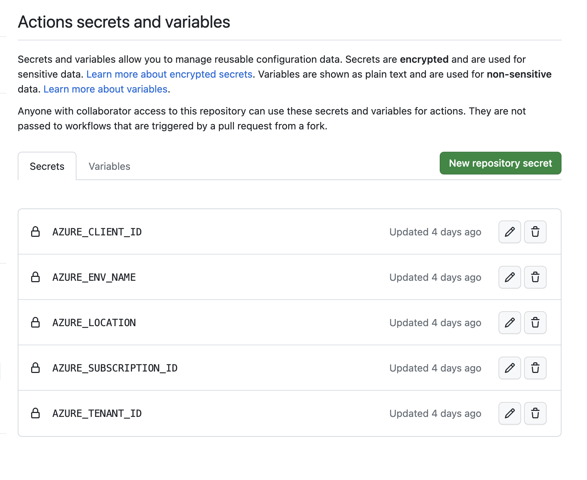

# Bonus: Using AZD + GitHub Actions to Manage your Deployment

You can also redeploy your project to Azure using GitHub Actions. This will allow GitHub to redeploy your project to Azure when changes are made without manually running `azd deploy`.

## Using GitHub Actions

We've included a GitHub Action workflow file in [azure-dev.yaml](../.github/workflows/azure-dev.yaml). This workflow runs the provision and deployment steps using Federated Credentials.

To setup your GitHub repo, run the following command:

```shell
azd pipeline config
```

Enter the required information. 

https://user-images.githubusercontent.com/8632637/231233580-c0f1d520-f81d-4db5-931e-2b96cb7d2ec6.mp4

The information required by the workflow will be added to your GitHub repo.



## Running the GitHub Action

Once that is complete you can run the GitHub Action workflow.

We've intentionally commented out the automated deployment steps but you can uncomment them to automatically deploy your project to Azure. For now, we can manually trigger the deployment using the GitHub Actions tab.

1. Open your repo in GitHub and select the Actions tab on top left.
2. In the Actions side menu, under _All workflows_ select the _Azure Developer CLI_.
3. A blue banner that says "This workflow has a workflow_dispatch event trigger will appear in the main section of the page. Click the _Run workflow_ button.
4. A _Use workflow from_ window will appear. Click the green _Run workflow_ button. 

https://user-images.githubusercontent.com/8632637/231231358-bd5f70e4-a5e9-42c6-9c0f-33885629c529.mp4

